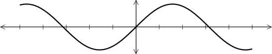

# SimpleDrawing


[](https://travis-ci.com/scheinerman/SimpleDrawing.jl)


This package provides some convenient drawing tools derived from the
`Plots` module. It also defines the `draw()` function that can be extended
by other modules including `DrawSimpleGraphs`, `HyperbolicPlane`, and
(maybe some day) poset drawing for `SimplePosets`.

## Functions

### General

+ `newdraw()` presents a blank canvas on which to draw (and erases anything
that's already in that window).
+ `finish()` ensures that the figure appears on the screen with
aspect ratio equal to 1, and that
we hide the axes, grid, and legend.
+ `draw()` does nothing. It is a placeholder function for other modules to
override.

### Drawing Specific Shapes
+ `draw_point(x::Real,y::Real;opts...)` plots a point (small disk). This
may also be invoked as `draw_point(z::Complex)`. If `plist` is a list of
complex numbers, may also use `draw_point(plist)` to draw all those points.
+ `draw_segment(x::Real,y::Real,xx::Real,yy::Real;opts...)` draws a
line segment from `(x,y)` to `(xx,yy)`. May also be invoked as
`draw_segment(z::Complex,zz::Complex)`.
+ `draw_vector(x::Real,y::Real)` draws a vector from `(0,0)` to `(x,y)`. A
different base point may be specified `draw_vector(x,y,basex,basey)` in which
case the vector starts at `(basex,basey)` and extends to `(basex+x,basey+y)`.
This may also be used with complex arguments: `draw_vector(z)` and
`draw_vector(z, basez)`.
+ `draw_arc(x::Real,y::Real,r::Real,t1::Real,t2::Real;opts...)` draws an
arc of a circle centered at `(x,y)`, with radius `r`, and arcing between
angles `t1` and `t2`.
+ `draw_arc(a::Complex,b::Complex,c::Complex;opts...)` draws
the arc with end points `a` and `c` passing through `b`.
+ `draw_circle(x::Real,y::Real,r::Real;opts...)` draws a circle centered
at `(x,y)` with radius `r`. Also `draw_circle(z::Complex,r::Real;opts...)`.
+ `draw_curve(pts;opts...)` draws a curve through the points specified by `pts`, a
one-dimensional array of complex numbers. By default, this gives a closed curve.
To draw an open curve, use `draw(pts,false;opts...)`
+ `draw_rectangle(x::Real,y::Real,xx::Real,yy::Real;opts...)` draws a rectangle
with corners `(x,y)` and `(xx,yy)`.
Also available as `draw_rectangle(w::Complex,z::Complex)`.


### Drawing Coordinate Axes

The functions `draw_xaxis` and `draw_yaxis` can be used to create axes for figure.
We assume that the axes emanate from the origin.
+ `draw_xaxis(x)` draws an axis from the origin to `(x,0)`.
+ `draw_xaxis(x1,x2)` is equivalent to calling `draw_xaxis(x1)` and then `draw_xaxis(x2)`.
+ `draw_xaxis()` draws a pair of x-axes extended 10% further than the values returned by `xlims()`.

The function `draw_yaxis()` has analogous behavior.

The functions `draw_xtick` and `draw_ytick` can be used to make small 
tick marks on the axis.
+ `draw_xtick(x,len)` draws a small tick mark with total length `len`
at the point `x` on the x-axis.
+ `draw_xtick(xlist,len)` calls `draw_xtick` for the values in `xlist`.

If `len` is omitted, a default value is used. The function `draw_ytick` 
works analogously. 

#### Example
```julia
julia> using Plots, SimpleDrawing
julia> plot(sin,-5,5,linewidth=2,color=:black)
julia> draw_xaxis()
julia> draw_yaxis()
julia> draw_xtick(-5:5)
julia> finish()
```




### Supporting Functions

+ `find_center(a,b,c)` returns the center of the circle that passes through
the three points (represented as complex numbers). Returns
`inf + inf*im` if the points are collinear.

+ `non_collinear_check(a,b,c)` checks if the three points (represented as
  complex numbers) are noncollinear; returns `true` if so and `false` if they
  are collinear (including if two are the same).

## Spying a matrix

`my_spy(A)` creates a black-and-white image representing the matrix `A`
in which nonzero entries are black squares and zeros are white squares.

For example, if the matrix is this:
```
julia> A
5×8 Array{Int64,2}:
 1  1  0  0  1  1  1  0
 1  0  1  0  0  1  1  1
 0  1  0  1  1  0  1  0
 0  1  0  1  0  1  1  1
 1  1  1  1  0  0  1  0
 ```
 then `my_spy(A)` creates this image:
 
 

## Example

```
using SimpleDrawing, Plots
newdraw()
draw_circle(1,1,2; color=:red)
draw_arc(2,1,1,0,pi; color=:blue, linestyle=:dash)
draw_segment(-1+im,1+im; color=:green, linestyle=:dot)
savefig("example.png")
```


## Splines

The implementation of `draw_curve` relies on cubic splines. Let `y` be an
`n`-long array of numbers. Then use one of these to create an interpolating
spline:
+ `S = Spline(y,:open)` for an open-ended spline.
+ `S = Spline(y,:closed)` for a periodic spline.

In both cases, `S(1)==y[1]` through `S(n)==y[n]`. For closed splines, however,
`S(n+1)==y[1]` and so forth.

Note that while `S` can be applied like a function, if is not a Julia `Function`.
Thus `plot(S,1,4)` won't work. To convert a spline to a callable function, use
`funk(S)`.

The derivative of `S` is available as `S'`. The derivative is also of type
`Spline`; to plot its values over the interval `[a,b]`, use `plot(funk(S'),a,b)`.
